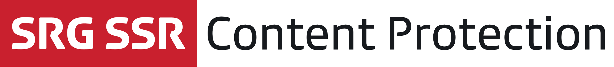

<p align="center"></p>

[](https://github.com/Carthage/Carthage)

## About

The SRG Content Protection framework contains the sensitive logic required for protected media playback. The following protection measures are currently supported:

* Akamai secure token.
* Digital Rights Management via FairPlay.

## Compatibility

The library is suitable for applications running on iOS 9 and above. The project is meant to be opened with the latest Xcode version (currently Xcode 10).

## Contributing

If you want to contribute to the project, have a look at our [contributing guide](CONTRIBUTING.md).

## Installation

The library can be added to a project using [Carthage](https://github.com/Carthage/Carthage) by adding the following dependency to your `Cartfile`:
    
```
github "SRGSSR/srgcontentprotection-ios"
```

For more information about Carthage and its use, refer to the [official documentation](https://github.com/Carthage/Carthage).

### Dependencies

The library requires the following frameworks to be added to any target requiring it:

* `libextobjc`: A utility framework.
* `MAKVONotificationCenter`: A safe KVO framework.
* `SRGContentProtection`: The content protection library framework.
* `SRGDiagnostics`: Framework for collecting diagnostic information.
* `SRGLogger`: The framework used for internal logging.
* `SRGNetwork`: A networking framework.

### Dynamic framework integration

1. Run `carthage update` to update the dependencies (which is equivalent to `carthage update --configuration Release`). 
2. Add the frameworks listed above and generated in the `Carthage/Build/iOS` folder to your target _Embedded binaries_.

If your target is building an application, a few more steps are required:

1. Add a _Run script_ build phase to your target, with `/usr/local/bin/carthage copy-frameworks` as command.
2. Add each of the required frameworks above as input file `$(SRCROOT)/Carthage/Build/iOS/FrameworkName.framework`.

### Static framework integration

1. Run `carthage update --configuration Release-static` to update the dependencies. 
2. Add the frameworks listed above and generated in the `Carthage/Build/iOS/Static` folder to the _Linked frameworks and libraries_ list of your target.
3. Also add any resource bundle `.bundle` found within the `.framework` folders to your target directly.
4. Add the `-all_load` flag to your target _Other linker flags_.

## Building the project

A [Makefile](../Makefile) provides several targets to build and package the library. The available targets can be listed by running the following command from the project root folder:

```
make help
```

Alternatively, you can of course open the project with Xcode and use the available schemes.

## Usage

When you want to use classes or functions provided by the library in your code, you must import it from your source files first.

### Usage from Objective-C source files

Import the global header file using:

```objective-c
#import <SRGContentProtection/SRGContentProtection.h>
```

or directly import the module itself:

```objective-c
@import SRGContentProtection;
```

### Usage from Swift source files

Import the module where needed:

```swift
import SRGContentProtection
```

### Playing a protected media

To play a protected media with AVPlayer, create an asset through one of the methods from the `AVURLAsset (SRGContentProtection)` category, and use it to instantiate the `AVPlayerItem` which will be played.

## Known limitations

FairPlay stream playback requires a physical iOS device. Streams will not play in the simulator.

## License

See the [LICENSE](../LICENSE) file for more information.
